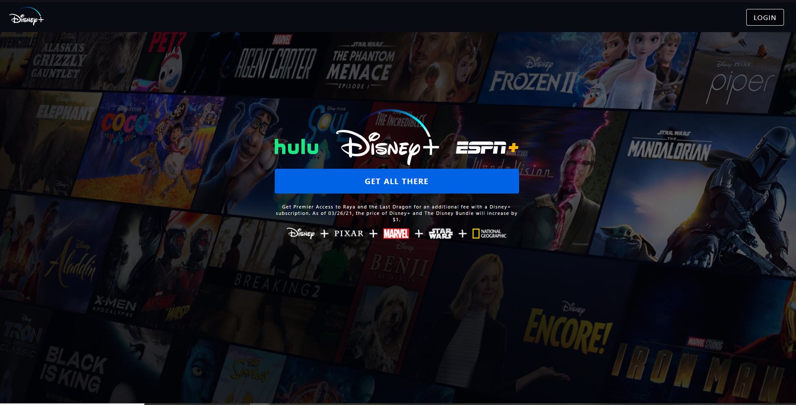
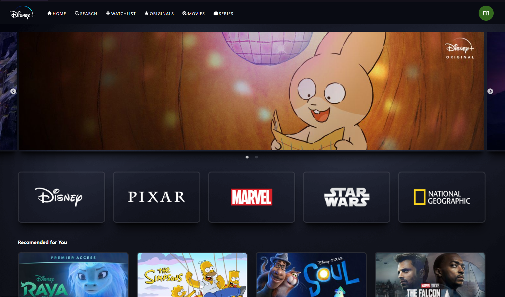
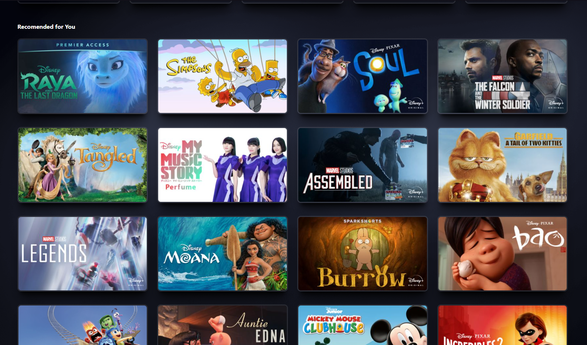

<div id="top"></div>


## Sobre o projeto


<div align="center"><a href="#top">telalogin


                                                    

>Clone da Disney Plus. O projeto foi desenvolvido com ReactJs e Styled-components, redux-toolkit e firebase.
</a></div>

<a href="https://disneyplus-clone-3eeed.web.app/detail/4vJe1ekutfvs1u8Z1aXK" target="_blank">
    
  </a>

<p align="left">(<a href="https://disneyplus-clone-3eeed.web.app/detail/4vJe1ekutfvs1u8Z1aXK">Clique aqui para abrir um demontraçâo</a>)</p>


##🚀 Tecnologias


* ReactJs
* React-Redux
* Redux Toolkit
* Styled-Components
* React hooks                                                                                        
* Firebase
* Firebase auth


<p align="right">(<a href="#top">back to top</a>)</p>


<


### Como usar

2. Clone o repositorio
   ```sh
   git clone https://github.com/MikaelSantos1/disneyplus_clone.git
   ```
3. Instale as  depencias
   ```sh
  npm install
   ```
4. Inicie o projeto
   ```js
   npm start
   ```

<p align="right">(<a href="#top">back to top</a>)</p>
